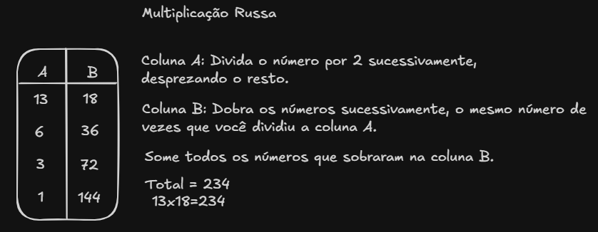

# EstruturaDeDados

Estruturas de dados são formas de organizar, armazenar e manipular dados de maneira eficiente dentro de um programa ou sistema. Elas influenciam diretamente o desempenho das aplicações, especialmente em operações como acesso, inserção, remoção, busca e ordenação.

>Estruturas de dados (ED) implementam tipos de dados abstratos (TAD) e definem operações como inserção, remoção, busca e ordenação.

## Classificação das Estruturas de Dados
As estruturas de dados podem ser classificadas em lineares e não lineares.

### Estruturas de Dados Lineares
#### Vetores (Arrays):
- Armazenam elementos de maneira sequencial e contínua na memória.
- Acesso rápido aos elementos, mas o tamanho é fixo.

"*Indicados quando o número de elementos é conhecido previamente.*"

#### Listas encadeadas:
- Sequência de elementos onde cada elemento aponta para o próximo.
- Listas podem ser simples (apenas com um ponteiro para o próximo) ou duplamente encadeadas (com ponteiro para o próximo e para o anterior).

>[!NOTE]
>Filas Encadeadas:
    - Uma fila encadeada é uma variação da estrutura de fila, onde os elementos são armazenados em **nós** (objetos), e cada nó contém o valor e uma referência (ponteiro) para o próximo nó.
    - As filas encadeadas não têm um tamanho fixo, o que permite a inserção e remoção de elementos sem a necessidade de realocar toda a estrutura.  

#### Pilhas (Stacks):
- Funciona no princípio "Último a Entrar, Primeiro a Sair" (LIFO).
- Ideal para situações como desfazer ações ou chamadas de funções.
- Operações principais:
  - `push` (*inserção*)
  - `pop` (*remoção*)

#### Filas (Queues):
- Funciona no princípio "Primeiro a Entrar, Primeiro a Sair" (FIFO).
- Usada para controle de tarefas em que a ordem de chegada importa (como em sistemas de impressão).

### Métodos não lineares
*"São aquelas em que os elementos não seguem uma sequência linear."*
#### Árvores:
- Estruturas hierárquicas composta por:
  - Um nó raiz
  - Nós filhos
- Cada nó pode ter zero ou mais filhos.
"*Utilizadas para representar hierarquias (como pastas de arquivos ou estruturas de diretórios)."*

#### Tabelas Hash (Hash Tables)
- Associam chaves a valores por meio de uma função hash.
- Permitem acesso muito rápido aos dados (em média O(1)).
- Podem sofrer colisões, que precisam ser tratadas.

### Conceitos importantes relacionados
#### Recursão
A recursão é tratada como qualquer outra chamada de função. Isso envolve guardar o estado atual do processamento de maneira que ela possa continuar de onde parou, quando a função estiver terminada. Guardar o estado de um processamento consome tempo e memória, por isso a recursão é usualmente tida como menos eficiente que a iteração (repetição).

[Instrutivo sobre recursão com exemplos](./docs/funcoes_recursivas.md)
- ##### Multiplicação Russa
A Multiplicação Russa (também conhecida como multiplicação por duplicação e divisão por metade) é um método que permite multiplicar qualquer dois números inteiros usando apenas duas operações simples: dobrar e dividir por dois.

#### Ordenação
- Ordenar corresponde ao processo de rearranjar um 
conjunto de objetos em uma ordem ascendente ou 
descendente.
- O objetivo principal da ordenação é facilitar a 
recuperação posterior de itens do conjunto ordenado. 

Ordenação é o processo de rearranjar elementos em uma ordem crescente ou decrescente, facilitando buscas e análises posteriores.

- ##### Bubble Sort
  - Percorre o vetor diversas vezes
  - Comparar elementos adjacentes e os troca se estiverem fora de ordem
- ##### Quicksort
  O algoritmo `quicksort` utiliza a técnica DC (Dividir para conquistar),   compostas pelos seguintes passos:

  1. Descubra o caso-base, que deve ser o caso mais simples possível.
  2. Descubra como reduzir o seu problema para que ele se torne o caso-base.

  *'O algoritmo DC não é um simples algoritmo que você aplica em um problema, mas   sim uma maneira de pensar sobre o problema'*

#### Busca binária

A busca binária é um algoritmo eficiente para encontrar um elemento em um vetor/lista ordenada.
Ela funciona dividindo o vetor ao meio a cada passo, comparando o elemento do meio com o valor que você está procurando, e descartando a metade que não pode conter o valor. Isso reduz o número de comparações, tornando a busca muito mais rápida que a busca linear.

>[!WARNING] 
>O vetor/lista deve estar ordenada.

[Exemplo de código com busca binária](./algoritmos/busca/busca_binaria.py)